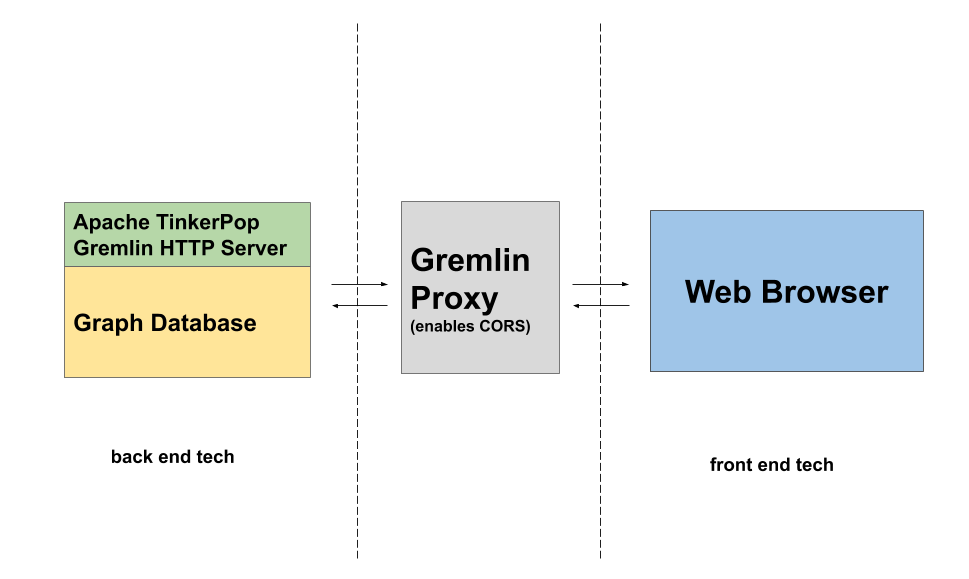

# Gremlin Server Proxy 

Proxy layer for Apache TinkerPop's Gremlin Server to support their authentication abilities from web browsers enabling CORS.

[](https://github.com/invanalabs/gremlin-proxy/blob/master/LICENSE) 
[](https://hub.docker.com/r/invanalabs/gremlin-proxy)
[](https://invana.io/docs.html)

This project let's you connect to your favorite Gremlin Server using connection 
strings from the web browsers. This service doesn't add any layer of security, 
it just avoids the CORS issue. You can extend this service to add your own authentication 
or event logging.




## Installation
| Environment Variable        | default           | Example                            |
|:--------------------------- |:-----------------:| ----------------------------------:|
| GREMLIN_HOST                | null              | eg: http://127.0.0.1:8182, https://api.domain.io |
 
**Note** only http hosts are acceptable.

##### Install on Heroku
[](https://heroku.com/deploy?template=https://github.com/invanalabs/graph-explorer/tree/master)


##### Run from docker image
```shell script
docker run -p 9600:9600 -e GREMLIN_HOST=http://127.0.0.1:8182 -d --name gremlin-proxy invanalabs/gremlin-proxy 
```

##### Build from dockerfile
```shell script
git clone git@github.com:invanalabs/gremlin-proxy.git
cd gremlin-proxy
docker build . -t gremlin-proxy 
docker run --name gremlin-proxy -d -p 9600:9600 -e GREMLIN_HOST="http://192.168.0.10:8182" gremlin-proxy 

```

## License 

Apache License 2.0

## Support

For any further queries or dedicated support, please feel free to get in touch with me at hi[at]invana.io.

